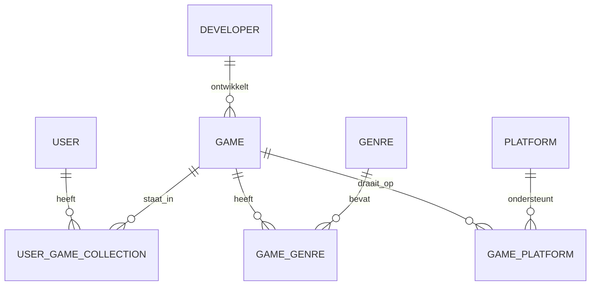
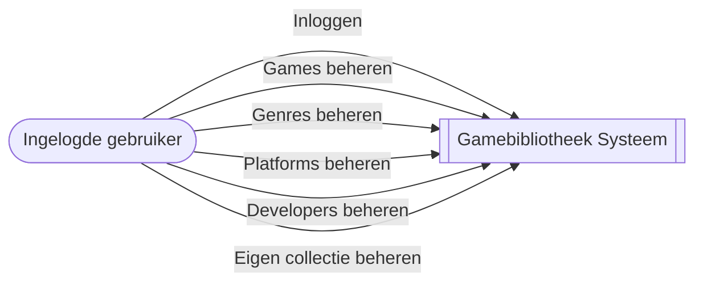
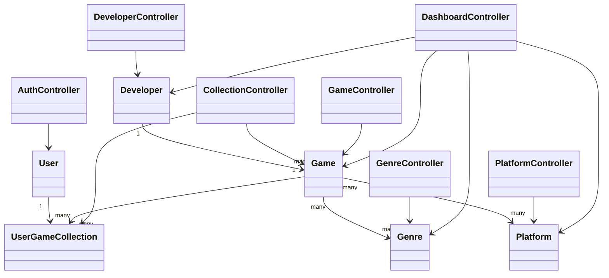
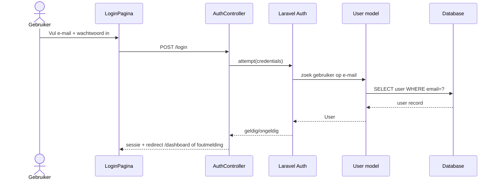
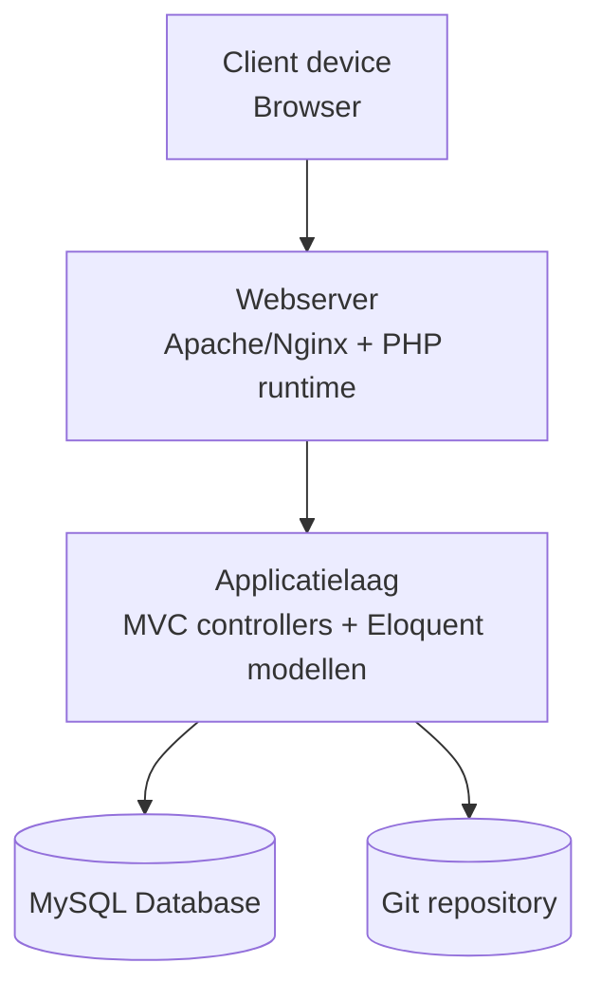

# Analyse- en ontwerpdocument - Gamebibliotheek

## 1. Inleiding

Dit document beschrijft de analyse en het ontwerp van een webapplicatie voor het beheren van een gamebibliotheek.  
De applicatie ondersteunt het registreren van games, genres, platforms en developers, plus het beheren van een persoonlijke collectie per gebruiker.

Doel van het systeem:

- centraal beheer van gamegegevens;
- inloggen voor beveiligd onderhoud van data;
- CRUD-functionaliteit op kernentiteiten;
- inzicht in relaties tussen games, genres, platforms en gebruikerscollecties.

## 2. Analyse van eisen en wensen

### 2.1 Stakeholders

- **Beheerder (admin):** wil alle basisdata kunnen beheren en gebruikers kunnen ondersteunen.
- **Gebruiker (member):** wil eigen gamecollectie opbouwen en bijhouden.
- **Docent-examinator:** wil aantoonbaar zien dat de oplossing voldoet aan de opdrachtcriteria.

### 2.2 Functionele eisen (must)

1. Gebruiker kan inloggen met e-mail en wachtwoord.
2. Systeem biedt CRUD op minimaal:
   - games;
   - genres;
   - platforms;
   - developers.
3. Systeem bevat minimaal een veel-op-veel-relatie.
4. Gebruiker kan games toevoegen aan eigen collectie.
5. Systeem valideert invoer (verplichte velden, unieke waarden waar nodig).
6. Alleen ingelogde gebruikers hebben toegang tot beheerpagina's.

### 2.3 Niet-functionele eisen

- Responsive webdesign (desktop, tablet, mobiel).
- HTML5 valide output.
- CSS3 in losse stylesheets, valideerbaar.
- Basisbeveiliging voor login (gehashte wachtwoorden, sessiebeheer).
- Overzichtelijke en consistente navigatie.

### 2.4 Wensen (should)

- Filteren op genre, platform en status.
- Zoekfunctie op titel.
- Rollenmodel met `admin` en `member`.
- Duidelijke feedbackmeldingen na acties (toegevoegd, bijgewerkt, verwijderd).

## 3. Kwaliteitscriteria en validatie

## 3.1 Definition of Done (DoD)

Een user story is "done" als:

- functionaliteit aantoonbaar werkt volgens acceptatiecriteria;
- code objectgeorienteerd is opgezet volgens het gekozen ontwerp;
- relevante pagina's semantische HTML5 gebruiken;
- CSS3 gescheiden is van HTML en responsive gedrag heeft;
- databasewijzigingen via SQL-script reproduceerbaar zijn;
- foutafhandeling en validaties zichtbaar zijn in de UI.

### 3.2 Test- en validatiecriteria

- **Authenticatie**
  - Correcte login geeft toegang.
  - Foute login geeft foutmelding.
  - Uitgelogde gebruiker kan beheerpagina's niet openen.
- **CRUD**
  - Aanmaken, tonen, wijzigen en verwijderen werkt voor hoofdentiteiten.
  - Verwijderen van records met afhankelijkheden wordt correct afgehandeld.
- **Datakwaliteit**
  - Unieke velden (zoals e-mail, platformnaam) worden afgedwongen.
  - Foreign keys blijven geldig.
- **Frontendvalidatie**
  - HTML via [W3C Validator](https://validator.w3.org/).
  - CSS via [W3C CSS Validator](https://jigsaw.w3.org/css-validator/).

## 4. Functioneel ontwerp

### 4.1 Scope van het systeem

Binnen scope:

- gebruikersauthenticatie;
- beheer van masterdata (games, genres, platforms, developers);
- beheer van persoonlijke collectie met status en beoordeling.

Buiten scope:

- externe game API-koppelingen;
- multiplayer- of communityfuncties;
- geavanceerde aanbevelingsalgoritmen.

### 4.2 Hoofdfuncties

- Login/Logout.
- Overzicht en beheerpagina's voor games.
- CRUD games.
- CRUD genres.
- CRUD platforms.
- CRUD developers.
- Toevoegen/wijzigen/verwijderen van games in persoonlijke collectie.

Op dit moment zijn beheerschermen toegankelijk voor iedere ingelogde gebruiker.  
Een striktere rol-autorisatie (admin/member) staat als mogelijke vervolgstap op de backlog.

## 5. Interactieontwerp

### 5.1 Informatiearchitectuur en navigatie

Primaire navigatie:

- Dashboard
- Games
- Genres
- Platforms
- Developers
- Mijn collectie
- Inloggen/Uitloggen

Navigatieprincipes:

- vaste topnavigatie op desktop;
- hamburgernavigatie op mobiel;
- duidelijke breadcrumb of paginatitel per scherm.

### 5.2 Lay-out en componenten

- 12-koloms grid op desktop, 1 kolom op mobiel.
- Overzichtspagina's met tabel op desktop en kaarten op mobiel.
- Formulieren met labels boven invoervelden.
- Actieknoppen met consistente kleuren (primair, secundair, gevaar).

### 5.3 Kleurenschema

- Primair: `#2563EB` (blauw)
- Secundair: `#1E293B` (donkergrijs)
- Accent/succes: `#16A34A` (groen)
- Waarschuwing: `#EA580C` (oranje)
- Achtergrond: `#F8FAFC` (lichtgrijs)
- Tekst: `#0F172A` (donker)

### 5.4 Typografie

- Font: `Inter`, fallback `Arial, sans-serif`.
- Basistekst: `16px`.
- H1: `32px`, H2: `24px`, H3: `20px`.
- Regelhoogte: `1.5`.

### 5.5 Responsive ontwerp

- Mobiel: `< 768px`.
- Tablet: `768px - 1023px`.
- Desktop: `>= 1024px`.
- Tabellen schalen naar kaartweergave op kleine schermen.

## 6. Databaseontwerp in stappen

### 6.1 Stap 1 - Conceptueel ERD

Toelichting:

- `GAME` en `GENRE` vormen een veel-op-veel-relatie via `GAME_GENRE`.
- `GAME` en `PLATFORM` vormen een veel-op-veel-relatie via `GAME_PLATFORM`.
- `USER` en `GAME` vormen een veel-op-veel-relatie via `USER_GAME_COLLECTION`.

### 6.2 Stap 2 - Relationeel schema

- `users(id PK, name, email UNIQUE, email_verified_at, password, remember_token, role, created_at, updated_at)`
- `developers(id PK, name UNIQUE, country, founded_year, created_at, updated_at)`
- `platforms(id PK, name UNIQUE, manufacturer, release_year, created_at, updated_at)`
- `genres(id PK, name UNIQUE, created_at, updated_at)`
- `games(id PK, title, release_date, pegi_age, developer_id FK -> developers.id, created_at, updated_at)`
- `game_genre(game_id PK/FK -> games.id, genre_id PK/FK -> genres.id)`
- `game_platform(game_id PK/FK -> games.id, platform_id PK/FK -> platforms.id)`
- `user_game_collections(user_id PK/FK -> users.id, game_id PK/FK -> games.id, status, rating, notes, added_at)`

### 6.3 Stap 3 - DDL (CREATE TABLE)

De SQL `CREATE TABLE` statements met foreign keys staan in:

- `docs/sql/schema.sql`

## 7. UML

### 7.1 Usecasediagram

### 7.2 Usecasebeschrijving - "Game toevoegen aan collectie"

- **Naam:** Game toevoegen aan collectie
- **Primaire actor:** Ingelogde gebruiker
- **Preconditie:** gebruiker is ingelogd
- **Trigger:** gebruiker klikt op "Toevoegen aan collectie"
- **Basispad:**
  1. Systeem toont collectiepagina met game-keuzelijst.
  2. Gebruiker kiest status (bijv. wishlist).
  3. Gebruiker slaat op.
  4. Systeem valideert invoer.
  5. Systeem maakt record in `user_game_collections`.
  6. Systeem toont succesmelding.
- **Alternatief pad:**
  - Als game al in collectie zit, toont systeem melding en biedt "bijwerken" aan.
- **Postconditie:** game is gekoppeld aan gebruiker met status en optionele rating.

### 7.3 Gelaagd klassendiagram (MVC)

### 7.4 Sequence diagram - Inloggen

### 7.5 Deploymentdiagram

## 8. Advies over eisen, wensen en kwaliteit

1. **Start met auth + rollen vroeg in het project.**  
   Dit voorkomt later refactoren van routes en rechten.

2. **Bouw database migratie-first.**  
   Eerst tabellen en constraints stabiel maken, daarna pas UI formulieren afronden.

3. **Test CRUD per entiteit met vaste testcase-set.**  
   Gebruik dezelfde teststappen voor create/read/update/delete voor voorspelbare kwaliteit.

4. **Kies een minimale maar consistente design system-aanpak.**  
   Leg kleuren, spacing en componentgedrag vroeg vast om UI-inconsistentie te voorkomen.

5. **Gebruik duidelijke commitgeschiedenis voor management & control.**  
   Werk met feature-branches en betekenisvolle commit messages als bewijs voor samenwerking.

## 9. Checklist-dekking (deel 1)

- Analyse eisen en wensen: **ja**
- Kwaliteitscriteria + validatiecriteria: **ja**
- Interactieontwerp (navigatie, lay-out, kleur, typografie, responsive): **ja**
- ERD: **ja**
- Relationeel schema: **ja**
- DDL (CREATE statements): **ja** (`docs/sql/schema.sql`)
- UML (usecase + beschrijving, klassendiagram, sequence, deployment): **ja**
- Advies over eisen/wensen/kwaliteit: **ja**
